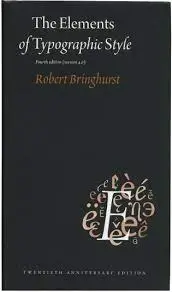

# 3 astuces CSS qui changent la vie

Dans cet article, nous allons détailler 3 astuces CSS qui permettent d'avoir une meilleure efficacité
lors du codage.

<!--truncate-->

## Unités relatives réactives

Utilisez des unités relatives de préférence aux unités fixes.

Un exemple avec des unités fixes:

```css
h1 {
  font-size: 32px;
}
h2 {
  font-size: 24px;
}
article {
  padding: 16px;
  margin: 8px;
}
```

C'est une mauvaise pratique en général. Avec des unités relatives, cela donne:

```css
h1 {
  font-size: 2em;
}
h2 {
  font-size: 1.75em;
}
article {
  padding: 1rem;
  margin: 0.5rem;
}
```

:::info

- **em** : relatif à la taille du texte du _parent_. 16px \* 2em = 32px
- **rem** : relatif à la taille du texte de la _racine_ (root).

:::

| Unit | Relative to                                                                                                                                                       |
| ---- | ----------------------------------------------------------------------------------------------------------------------------------------------------------------- |
| em   | Font size of the parent, in the case of typographical properties like font-size, and font size of the element itself, in the case of other properties like width. |
| ex   | x-height of the element's font.                                                                                                                                   |
| ch   | The advance measure (width) of the glyph "0" of the element's font.                                                                                               |
| rem  | Font size of the root element.                                                                                                                                    |
| lh   | Line height of the element.                                                                                                                                       |
| vw   | 1% of the viewport's width.                                                                                                                                       |
| vh   | 1% of the viewport's height.                                                                                                                                      |
| vmin | 1% of the viewport's smaller dimension.                                                                                                                           |
| vmax | 1% of the viewport's larger dimension.                                                                                                                            |

Vous trouverez plus d'informations en consultant [https://developer.mozilla.org/fr/docs/Learn/CSS/Building_blocks/Values_and_units](https://developer.mozilla.org/fr/docs/Learn/CSS/Building_blocks/Values_and_units)

## L'astuce du dimensionnement avec ch

:::info
ch: character width

ch: The advance measure (width) of the glyph "0" of the element's font.
:::

<div style={{textAlign: 'center'}}>



</div>

> " Anything from 45 to 75 characters is widely regarded as a satisfactory
> lengh of line for a single-column page set in a serifed text face in a text size. "

Autrement dit: un longueur de ligne comprise en 45 à 75 caractères est satisfaisante 👍

La traduction en CSS, pour dimensionner un paragraphe par exemple, peut être:

```css
p {
  width: clamp(45ch, 50%, 75ch);
}
```

## L'astuce des couleurs hsl

:::info
Utiliser les couleurs hsl plutôt que hexa ou rgb pour les codes couleur.

hsl: Hue Saturation Lightness

:::

```css
/* rgb */
p {
  color: rgb(100, 23, 20);
}

/* hex */
p {
  color: #ff0022;
}
/* hsl */
p {
  color: hsl(75, 50%, 50%);
}
```

En utilisant les couleurs hsl, vous avez un contrôle fin sur le contraste,
et pouvez créer facilement une palette de couleurs cohérente.

Par exemple:

```css
.hue25 {
  background: hsl(25, 50%, 50%);
}

.hue50 {
  background: hsl(50, 50%, 50%);
}

.hue75 {
  background: hsl(75, 50%, 50%);
}
```

<p style={{backgroundColor: "hsl(25, 50%, 50%)", color: "black"}}>HUE 25 </p>
<p style={{backgroundColor: "hsl(50, 50%, 50%)", color: "black"}}>HUE 50 </p>
<p style={{backgroundColor: "hsl(75, 50%, 50%)", color: "black"}}>HUE 75 </p>

Vous pouvez tester dans l'éditeur ci-dessous en changeant les valeurs:

```jsx live
<p
  style={{
    backgroundColor: 'hsl(50, 50%, 50%)',
    color: 'hsl(0, 0%, 0%)',
  }}
>
  Test HSL.
</p>
```

## L'astuce du scroll-padding-top

Cette astuce permet de définir la hauteur de scroll d'une page, et éviter que
certains liens "disparaissent" sous une barre de navigation par exemple.

```css
article {
  scroll-padding: 1rem 0 0 0;
}
```
