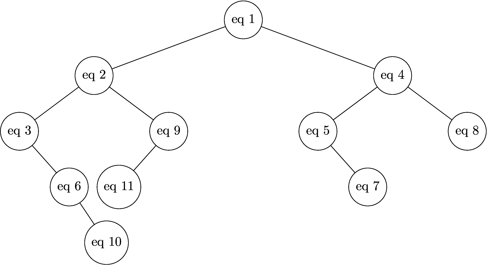
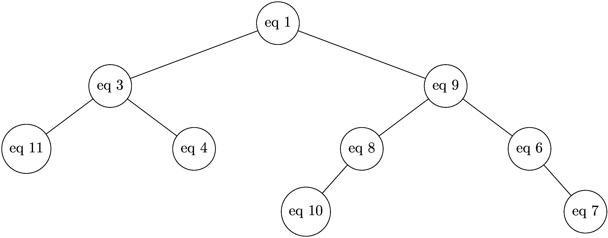

## Partie A

1. Code:

```python
chien40 = Chien(40, "Duke", "weel dog", 10)
```

2. Code:

```python
def changer_role(self, nouveau_role):
    """Change le rôle du chien avec la valeur passée en paramètre."""
    self.role = nouveau_role
```

3. Code:

```python
chien40.changer_role("leader")
```

## Partie B

4. Code:

```python
def retirer_chien(self, numero):
    nouvelle_liste_chien = []
    for chien in self.liste_chien:
        if chien.id_chien != numero:
            nouvelle_liste_chien.append(chien)
    self.liste_chien = nouvelle_liste_chien
```

Autre version, en utilisant les listes par compréhension:

```python
def retirer_chien(self, numero):
    self.liste_chien = [chien in self.liste_chien if chien.id_chien != numero]
```

5. Code:

```python
eq11.retirer_chien(46)
```

6. D'après le code fournit, `convert('4h36')` donne $4 + (3 + 6)/60= 4 + 9/60 = 4.15$

7. Code:

```python
def temps_course(equipe):
    temps_total = 0
    for temps in equipe.liste_temps:
        temps_total += convert(temps)
    return temps_total
```

## Partie C

8. Le plus simple ici est de trier les équipes par temps croissant pour faciliter la création de l'arbre.

- eq1: 7
- eq2: 4
- eq3: 1
- eq4: 10
- eq5: 8
- eq6: 2
- eq7: 9
- eq8: 11
- eq9: 6
- eq10: 3
- eq11: 5



9. Le parcours **infixe** permet d'obtenir les valeurs d'un ABR par ordre croissant.

10. La fonction `inserer`est récursive car elle s'appelle elle-même.

11. Code:

```python
def inserer(arb, eq):
    """ Insertion d'une équipe à sa place dans un ABR contenant
    au moins un noeud."""
    if convert(eq.temps_etape) < convert(arb.racine.temps_etape):
       if arb.gauche is None:
           arb.gauche = Noeud(eq)
       else:
           inserer(arb.gauche, eq)
    else:
       if arb.droit is None:
            arb.droit = Noeud(eq)
       else:
            inserer(arb.droit, eq)
```

12. Code:

```python
def est_gagnante(arbre):
     if arbre.gauche == None:
       return arbre.racine.nom_equipe
     else:
       return est_gagnante(arbre.gauche)
```

13. eq2 n'a qu'un fils droit. Donc on supprime eq2 et on relie son successeur eq3 à eq1.

eq5 a deux fils, on le remplace par son successeur, c'est-à-dire l'équipe qui a le temps
immédiatement supérieur, qui est le minimum de ses descendants droits.

Ici c'est eq9 qui est le minimum des descendants droits.



14. Code:

```python
def rechercher(arbre, equipe):
    if arbre is None:
        return False
    if arbre.racine == equipe:
        return True
    if convert(equipe.temps_etape) < convert(arbre.racine.temps_etape):
        return rechercher(arbre.gauche, equipe)
    else:
        return rechercher(arbre.droit, equipe)
```
