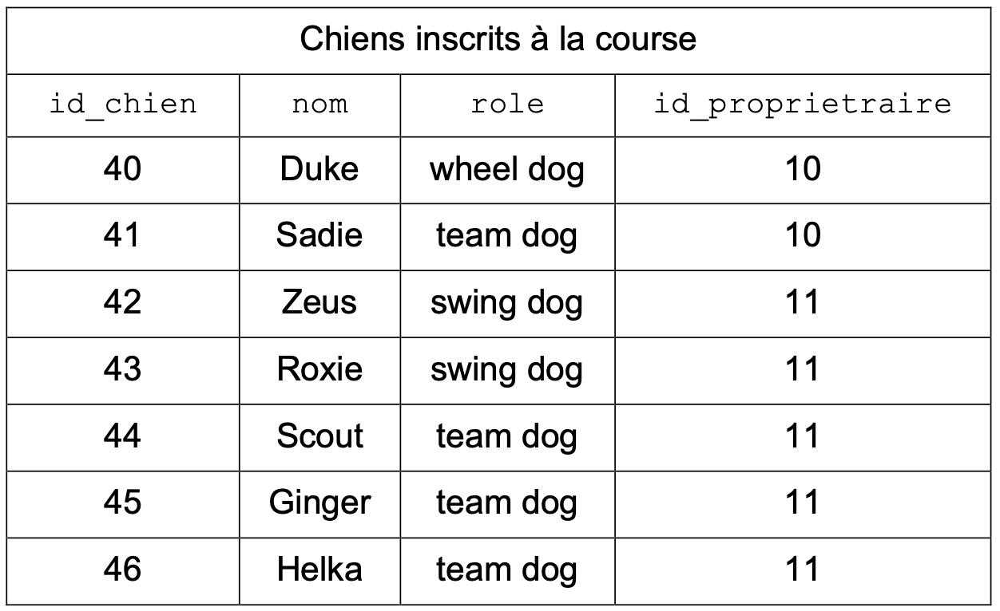
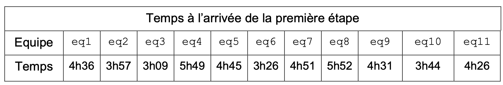
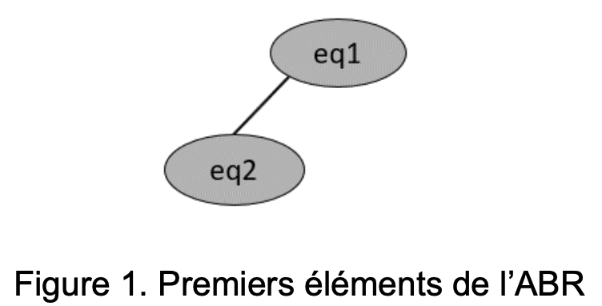
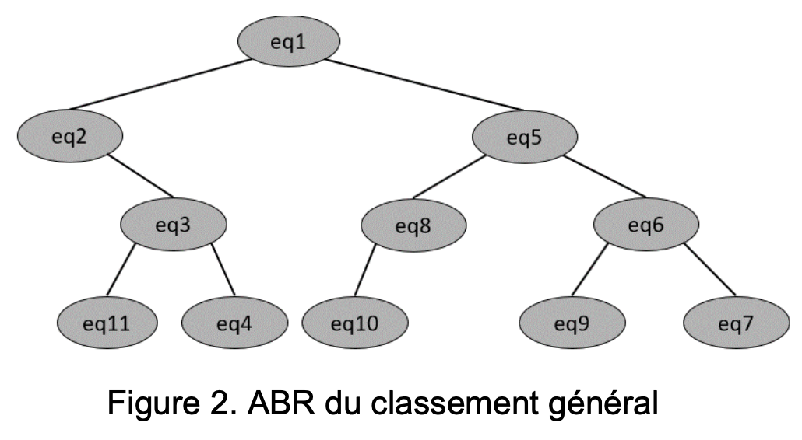

## EXERCICE 3 (8 points)

_Cet exercice porte sur la programmation orientée objet, sur les arbres binaires de recherche et la récursivité._

Chaque année, plusieurs courses de chiens de traîneaux sont organisées sur les terrains enneigés. L’une d’elle, _La Traversée Blanche_, est une course se déroulant en 9 étapes. L’organisateur de cette course est chargé de créer un programme Python
pour aider à la bonne gestion de l’événement.

### Partie A : la classe Chien

Afin de caractériser un chien, l’organisateur décide de créer une classe `Chien` avec les attributs suivants :

- `id_chien`, un nombre entier correspondant au numéro attribué au chien lors de son inscription à la course ;

- `nom`, une chaîne de caractères correspondant au nom du chien ;

- `role`, une chaîne de caractères correspondant au poste occupé par le chien : en fonction de sa place dans l’attelage, un chien a un rôle bien défini et peut être `'leader'`, `'swing dog'`, `'wheel dog'` ou `'team dog'`.

- `id_proprietaire`, un nombre entier correspondant au numéro de l’équipe.

Le code Python incomplet de la classe `Chien` est donné ci-dessous.

```python
1  class Chien:
2     def __init__(self, id_chien, nom, role, id_prop):
3         self.id_chien = id_chien
4         self.nom = nom
5         self.role = role
6         self.id_proprietaire = id_prop
7     def changer_role(self, nouveau_role):
8        """Change le rôle du chien avec la valeur passée en paramètre."""
9        ...
```

Voici un extrait des informations dont on dispose sur les chiens inscrits à la course.



Suite aux inscriptions, l’organisateur procède à la création de tous les objets de type `Chien` et les stocke dans des variables en choisissant un nom explicite. Ainsi, l’objet dont l’attribut `id_chien` a pour valeur 40 est stocké dans la variable `chien40`.

1. **Écrire** l’instruction permettant d’instancier l’objet `chien40` caractérisant le chien ayant le numéro d’inscription 40.

2. Selon l’état de fatigue de ses chiens ou du profil de l’étape, le _musher_ (nom donné à la personne qui conduit le traîneau) peut décider de changer le rôle des chiens dans l’attelage.

**Recopier** et **compléter** la méthode `changer_role` de la classe `Chien`.

3. Le propriétaire de Duke décide de lui attribuer le rôle de `'leader'`.

**Écrire** l’instruction permettant d’effectuer cette modification.

### Partie B : la classe Equipe

On souhaite à présent créer une classe `Equipe` ayant les attributs suivants :

- `num_dossard`, un nombre entier correspondant au numéro inscrit sur le dossard du musher ;

- `nom_equipe`, une chaîne de caractères correspondant au nom de l’équipe ;

- `liste_chiens`, une liste d’objets de type `Chien` dont chaque élément correspond à un chien au départ de l’étape du jour ;

- `temps_etape`, une chaîne de caractères (par exemple `'2h34'`) représentant le temps mis par l’équipe pour parcourir l’étape du jour ;

- `liste_temps`, une liste de chaînes de caractères permettant de stocker les temps de l’équipe pour chacune des 9 étapes. Cet attribut peut, par exemple, contenir la liste : `['4h36', '3h57', '3h09', '5h49', '4h45', '3h26',
'4h57', '5h52', '4h31']`.

On donne le code Python suivant de la classe `Equipe`.

```python
1 class Equipe:
2   def __init__(self, num_dossard, nom_equipe):
3       self.num_dossard = num_dossard
4       self.nom_equipe = nom_equipe
5       self.liste_chiens = []
6       self.temps_etape = ''
7       self.liste_temps = []
8
9   def ajouter_chien(self, chien):
10      self.liste_chiens.append(chien)
11
12  def retirer_chien(self, numero):
13      ...
14
15  def ajouter_temps_etape(self, temps):
16      self.liste_temps.append(temps)
```

Pour la première étape, le musher de l’équipe numéro 11, représentée en Python par l’objet `eq11`, décide de constituer une équipe avec les quatre chiens identifiés par les numéros 42, 44, 45 et 46. On donne ci-dessous les instructions Python permettant de créer l’équipe `eq11` et l’attelage constitué des 4 chiens précédents.

```python
1 eq11 = Equipe(11, 'Malamutes Endurants')
2 eq11.ajouter_chien(chien42)
3 eq11.ajouter_chien(chien44)
4 eq11.ajouter_chien(chien45)
5 eq11.ajouter_chien(chien46)
```

Malheureusement, le musher s’aperçoit que sa chienne Helka, chien numéro 46, n’est pas au mieux de sa forme et il décide de la retirer de l’attelage.

4. **Recopier** et **compléter** la méthode `retirer_chien` ayant pour paramètre numero, un entier correspondant au numéro attribué au chien lors de l’inscription, et permettant de mettre à jour l’attribut `liste_chiens` après retrait du chien dont la valeur de l’attribut `id_chien` est numero.

5. En vous aidant de la fonction précédente, écrire l’instruction qui permet de retirer Helka de l’attelage de l’équipe `eq11`.

On donne à présent le code Python d’une fonction `convert` prenant pour paramètre `chaine`, une chaîne de caractères représentant une durée, donnée en heure et minute.

On supposera que cette durée est toujours strictement inférieure à 10 heures, temps maximal fixé par le règlement pour terminer une étape.

```python
1 def convert(chaine):
2       heure_dec = int(chaine[0]) + int(chaine[2] + chaine[3])/60
3       return heure_dec
```

6. **Indiquer** le résultat renvoyé par l’appel `convert('4h36')`.

7. **Écrire** une fonction `temps_course` qui prend pour paramètre `equipe` de type `Equipe` et qui renvoie un nombre flottant correspondant au cumul des temps de l’équipe `equipe` à l’issue des 9 étapes de la course.

On rappelle que la classe `Equipe` dispose d’un attribut `liste_temps`.

### Partie C : classement à l’issue d’une étape

Chaque jour, à la fin de l’étape, on décide de construire un Arbre Binaire de Recherche (ABR) afin d’établir le classement des équipes. Chaque nœud de cet arbre est un objet de type `Equipe`.

Dans cet arbre binaire de recherche, en tout nœud :

- toutes les équipes du sous-arbre gauche sont strictement plus rapides que ce nœud ;

- toutes les équipes du sous-arbre droit sont moins rapides ou sont à égalité avec ce nœud.

Voici les temps, en heure et minute, relevés à l’issue de la première étape :



Dans l’arbre binaire de recherche initialement vide, on ajoute successivement, dans cet ordre, les équipes `eq1`, `eq2`, `eq3`, …, `eq11`, 11 objets de la classe `Equipe` tous construits sur le même modèle que l’objet `eq11` précédent.

8. Dans l’arbre binaire de recherche ci-dessous, les nœuds `eq1` et `eq2` ont été insérés.

**Recopier** et **compléter** cet arbre en insérant les 9 nœuds manquants.



9. **Indiquer** quel parcours d’arbre permet d’obtenir la liste des équipes classées de la plus rapide à la plus lente.

On donne ci-dessous la classe `Noeud`, permettant de définir les arbres binaires :

```python
1 class Noeud:
2   def __init__(self, equipe, gauche = None, droit = None):
3       self.racine = equipe
4       self.gauche = gauche
5       self.droit = droit
```

On donne ci-dessous le code d’une fonction `construction_arbre` qui, à partir d’une liste d’éléments de type `Noeud` permet d’insérer successivement chaque nœud à sa place dans l’ABR.

```python
1 def construction_arbre(liste):
2   a = Noeud(liste[0])
3   for i in range(1,len(liste)):
4       inserer(a, liste[i])
5   return a
```

La fonction `construction_arbre` fait appel à la fonction `inserer` qui prend pour paramètre `arb`, de type `Noeud`, et `eq`, de type `Equipe`. Cette fonction construit le nœud
à partir de `eq` et l’insère à sa place dans l’ABR.

```python
1 def inserer(arb, eq):
2   """ Insertion d'une équipe à sa place dans un ABR contenant
3   au moins un noeud."""
4   if convert(eq.temps_etape) < convert(arb.racine.temps_etape):
5       if arb.gauche is None:
6           arb.gauche = ...
7       else:
8           inserer(..., eq)
9   else:
10      if arb.droit is None:
11          arb.droit = Noeud(eq)
12      else:
13          ...
```

10. **Expliquer** en quoi la fonction `inserer` est une fonction récursive.

11. **Recopier** et **compléter** les lignes 6, 8 et 13 de la fonction `inserer`.

12. **Recopier** et **compléter** les lignes 3 et 5 de la fonction `est_gagnante` ci-dessous qui prend en paramètre un ABR `arbre`, de type `Noeud`, et qui renvoie le nom de l’équipe ayant gagné l’étape.

```python
1 def est_gagnante(arbre):
2     if arbre.gauche == None:
3       return ...
4     else:
5       return ...
```

### Partie D : classement général

On décide d’établir un classement général obtenu à partir du cumul des temps mis par chaque équipe pour parcourir l’ensemble des 9 étapes.

Sur le même principe que l’arbre de la partie précédente, on construit l’ABR ci-dessous qui permet, grâce au parcours d’arbre approprié, d’établir ce classement général des
équipes.



Le règlement prévoit la disqualification d’une équipe en cas de non-respect de celui-ci. Il s’avère que l’équipe 2 et l’équipe 5 doivent être disqualifiées pour manquement au règlement. Les nœuds `eq2` et `eq5` doivent donc être supprimés de l’ABR précédent.

Pour supprimer un nœud `N` dans un ABR, trois possibilités se présentent :

- le nœud `N` à supprimer est une feuille : il suffit de le retirer de l’arbre ;

- le nœud `N` à supprimer n’a qu’un seul fils : on relie le fils de `N` au père de `N` et on supprime le nœud `N` ;

- le nœud `N` à supprimer possède deux fils : on le remplace par son successeur (l’équipe qui a le temps immédiatement supérieur) qui est toujours le minimum de ses descendants droits.

13. **Dessiner** le nouvel arbre de recherche `a_final` obtenu après suppression des équipes `eq2` et `eq5` dans l’ABR correspondant au classement général.

L’organisateur souhaite disposer d’une fonction rechercher permettant de savoir si une équipe a été disqualifiée ou non. On donne les spécifications de la fonction `rechercher`, prenant en paramètre `arbre` et `equipe`.

```python
1 def rechercher(arbre, equipe):
2   """
3       Paramètres
4       ---------
5           arbre : un ABR, non vide, de type Noeud, représentant le
6           classement général.
7           equipe : un élément, de type Equipe, dont on veut déterminer
8           l'appartenance ou non à l'ABR arbre.
9       Résultat
10      ---------
11          Cette fonction renvoie True si equipe est un nœud de arbre,
12          False sinon.
13 """
14 ...
```

Pour cette fonction (`a_final` désigne l’arbre obtenu à la question 13, après
suppression des équipes 2 et 5) :

- l’appel `rechercher(a_final, eq1)` renvoie `True` ;

- l’appel `rechercher(a_final, eq2)` renvoie `False`.

14. **Écrire** le code de la fonction
