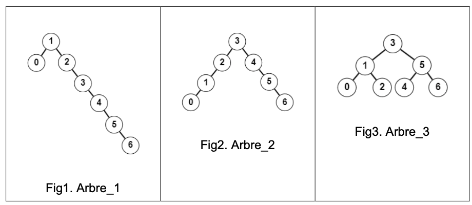

## Exercice 2 (6 points)

_Cet exercice porte sur les arbres binaires de recherche, la POO et la récursivité._

Nous disposons d’une classe `ABR` pour les arbres binaires de recherche dont les clés sont des entiers :

```python
1 class ABR():
2   def __init__(self) :
3       # Initialise une instance d'ABR vide.
4
5   def cle(self):
6       # Renvoie la clé de la racine de l'instance d'ABR.
7
8   def sad(self):
9       # Renvoie le sous-arbre droit de l'instance d'ABR.
10
11  def sag(self):
12      # Renvoie le sous-arbre gauche de l'instance d'ABR.
13
14  def est_vide(self):
15      # Renvoie True si l'instance d'ABR est vide et False sinon.
16
17  def inserer(self, cle_a_inserer):
18        # Insère cle_a_inserer à sa place dans l'instance d'ABR.
```

Considérons ci-dessous trois arbres binaires de recherche :



Dans tout l’exercice, nous ferons référence à ces trois arbres binaires de recherche et utiliserons la classe `ABR` et ses méthodes.

### Partie A

1. Un arbre est une structure de données hiérarchique dont chaque élément est un nœud.

**Recopier** et **compléter** le texte ci-dessous en choisissant des expressions parmi `au maximum`, `au minimum`, `exactement`, `feuille`, `racine`, `sous-arbre gauche` et `sous-arbre droit` :

- Le nœud initial est appelé ... .
- Un nœud qui n’a pas de fils est appelé ....
- Un arbre binaire est un arbre dans lequel chaque nœud a ... deux fils.
- Un arbre binaire de recherche est un arbre binaire dans lequel tout nœud est associé à une clé qui est :
  - supérieure à chaque clé de tous les nœuds de son ...
  - inférieure à chaque clé de tous les nœuds de son ....

2. Donner dans l’ordre les clés obtenues lors du parcours préfixe de l’arbre no 1.

3. Donner dans l’ordre, les clés obtenues lors du parcours suffixe, également appelé postfixe, de l’arbre no 2.

4. Donner dans l’ordre, les clés obtenues lors du parcours infixe de l’arbre no 3.

5. **Recopier** et **compléter** les instructions ci-dessous afin de définir puis de construire, en y insérant les clés dans un ordre correct (il y a plusieurs possibilités, on en demande une) , les trois instances de la classe `ABR` qui correspondent aux trois arbres binaires de recherche représentés plus haut.

```python
1 arbre_no1 = ...
2 arbre_no2 = ...
3 arbre_no3 = ...
4 for cle_a_inserer in [..., ..., ..., ..., ..., ..., ...]:
5   arbre_no1....
6 for cle_a_inserer in [..., ..., ..., ..., ..., ..., ...]:
7   arbre_no2....
8 for cle_a_inserer in [..., ..., ..., ..., ..., ..., ...]:
9   arbre_no3....
```

6. Voici le code de la méthode `hauteur` de la classe `ABR` qui renvoie la hauteur d’une instance d’ABR:

```python
1 def hauteur(self):
2   if self.est_vide() :
3       return -1
4   else :
5       return 1 + max(self.sag().hauteur(),
6                       self.sad().hauteur())
```

Donner, **en utilisant cette méthode**, la hauteur des trois instances arbre_no1, arbre_no2 et arbre_no3 de la classe `ABR` définies plus haut et qui correspondent aux trois arbres représentés plus haut.

7. **Recopier** et **compléter** le code de la méthode `est_presente` ci-dessous qui renvoie `True` si la clé `cle_a_rechercher` est présente dans l’instance d’`ABR` et
   `False` sinon :

```python
1 def est_present(self, cle_a_rechercher):
2   if self.est_vide() :
3       return ...
4   elif cle_a_rechercher == self.cle() :
5       return ...
6   elif cle_a_rechercher < self.cle() :
7       return ...
8   else :
9       return ...
```

8. **Expliquer** quelle instruction, parmi les trois ci-dessous, nécessitera le moins d’appels récursifs avant de renvoyer son résultat :

- `arbre_no1.est_presente(7)`.
- `arbre_no2.est_presente(7)`.
- `arbre_no3.est_presente(7)`.

### Partie B

9. On rappelle que la fonction `abs(x)` renvoie la valeur absolue de `x`. Par exemple:

```python
>>> abs(3)
3
>>> abs(-2)
2
```

On donne la méthode `est_partiellement_equilibre(self)` de la classe `ABR`. Cette méthode renvoie `True` si l’instance de la classe `ABR` est l’implémentation d’un arbre partiellement équilibré et `False` sinon :

```python
1. def est_partiellement_equilibre(self) :
2.  if self.est_vide() :
3.      return True
4.  return abs(self.sag().hauteur() -
                self.sad().hauteur() ) <= 1)
```

**Expliquer** ce qu’on appelle ici un arbre _partiellement équilibré_.

10. Un arbre binaire est _équilibré_ s’il est _partiellement équilibré_ et si ses deux sous-arbres, droit et gauche, sont eux-mêmes équilibrés.

Un arbre vide est considéré comme équilibré.

**Justifier** que, parmi les trois arbres définis plus haut, deux sont partiellement équilibrés.

11. **Justifier** que, parmi les trois arbres définis plus haut, un seul est équilibré.

12. **Définir** et **coder** la méthode récursive `est_equilibre` de la classe `ABR` qui renvoie `True` si l’instance de la classe `ABR` est l’implémentation d’un arbre équilibré et `False` sinon.
