Les tours de Hanoï est un casse-tête composé de trois tours et une pile de disques rangés du plus grand au plus petit.

Vous pouvez jouer en ligne en cliquant sur ce lien: http://www.monlyceenumerique.fr/nsi_terminale/lp/dl/tour_Hanoi.html

Le but est de déplacer la pile de disques sur la tour de droite en ne déplaçant à chaque fois qu'un seul disque et un disque ne peut pas être posé sur un disque plus petit.

## Déroulé pour 3 disques:

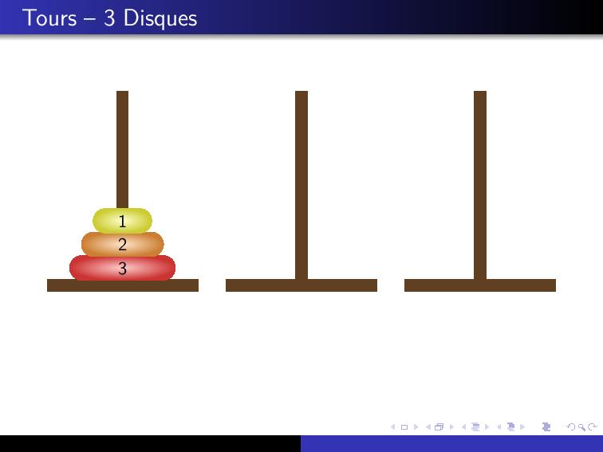
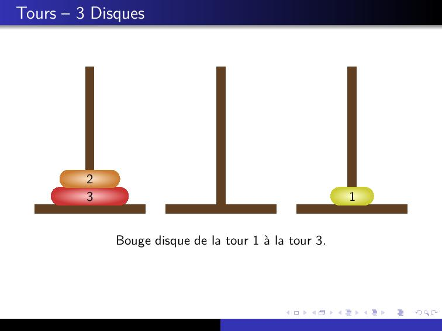
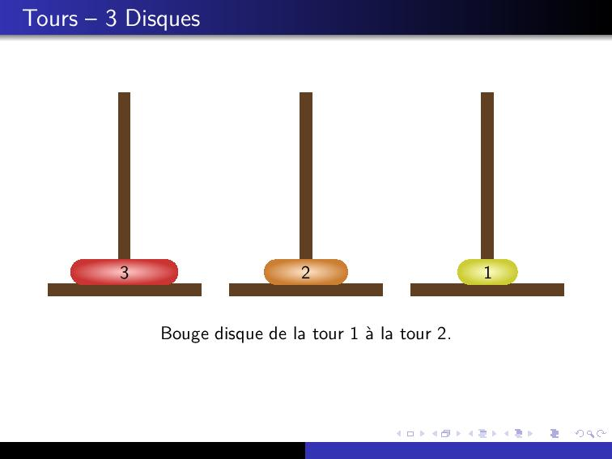
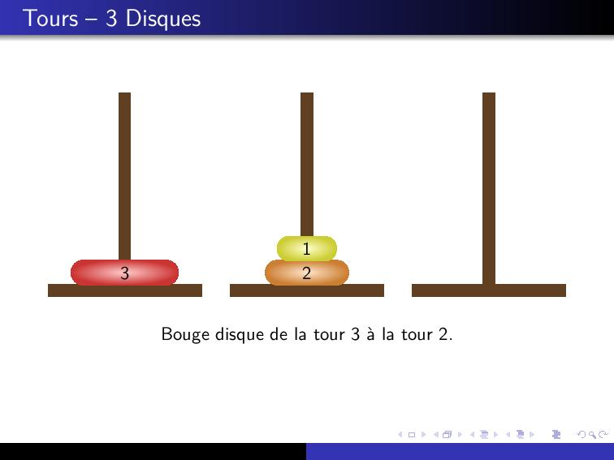
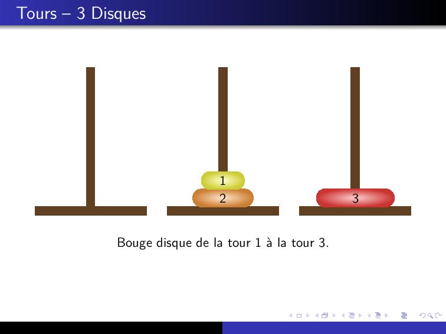
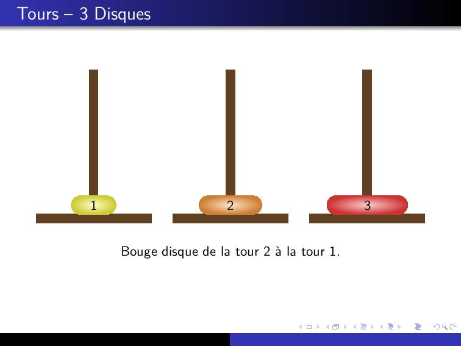
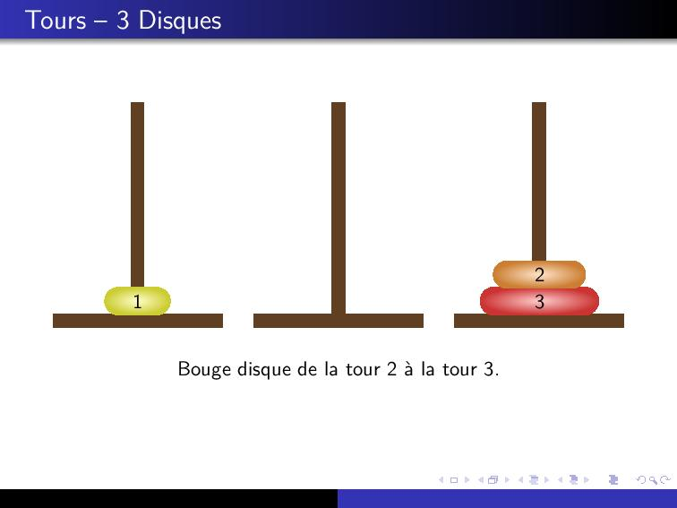
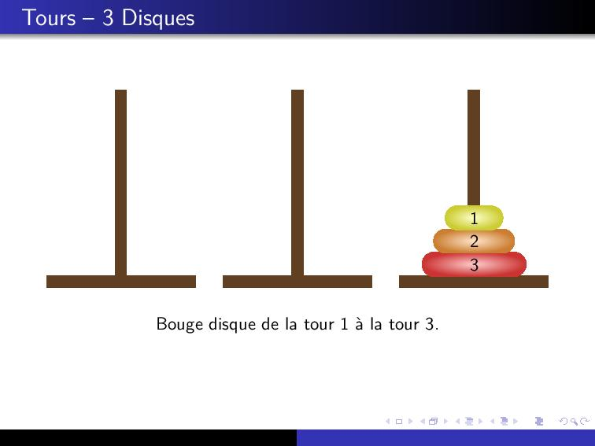

## Principe récursif

Nous allons voir qu'il est très simple de créer un programme récursif qui nous dit quoi faire pour résoudre le problème.

Tout d'abord on appelle les tours 1, 2 et 3.

On appelle $n$ le nombre de disque présents au départ dans la tour 1.

Pour déplacer tous les disques de la tour 1 vers la tour 3, on peut raisonner comme suit :

- On déplace $n-1$ disques de 1 vers la tour 2
- On déplace le dernier disque de 1 vers 3
- On déplace les $n-1$ disques de 2 vers 3

Exemple:

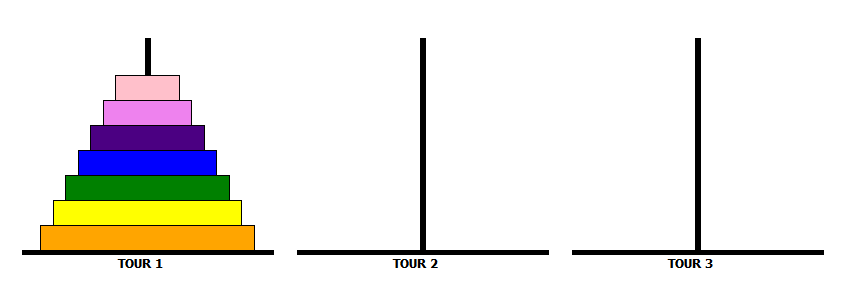

Pour déplacer une tour de $n$ disques de tour 1 vers tour 3, on effectue ces trois étapes :

- déplacer la tour des $n-1$ premiers disques de tour 1 vers tour 2

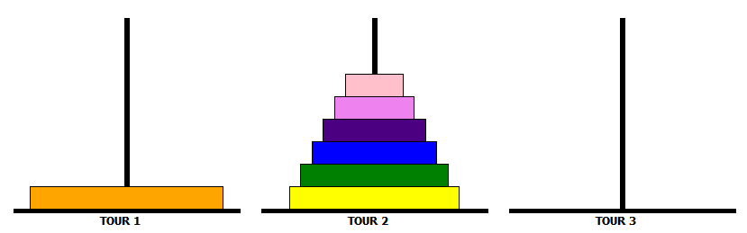

- déplacer le plus grand disque de tour 1 vers tour 3
  

- déplacer la tour des $n-1$ premiers disques de tour 2 vers tour 3
  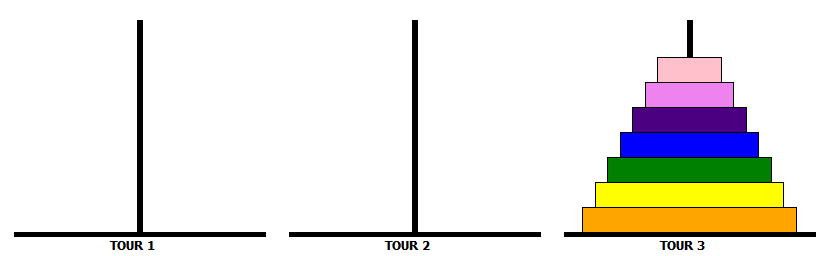

:::tip Astuce
L'astuce ici est de créer une fonction hanoi qui prend 4 paramètres : `hanoi(n,debut,inter,fin)` où `n` est le nombre de disques à déplacer, `debut` est la tour de départ de nos $n$ disques, `inter` est la tour intermédiaire que l'on peut utiliser pour déplacer et `fin` est la tour ou doivent se trouver les $n$ disques au final.
:::

## Consignes

Dans un fichier `hanoi.py` créer la fonction récursive `hanoi(n,debut,inter,fin)`.

Lors de l'appel `hanoi(3, 1, 2, 3)`, vous devez obtenir comme affichage:

```bash
Bouge disque de la tour 1 à la tour 3
Bouge disque de la tour 1 à la tour 2
Bouge disque de la tour 3 à la tour 2
Bouge disque de la tour 1 à la tour 3
Bouge disque de la tour 2 à la tour 1
Bouge disque de la tour 2 à la tour 3
Bouge disque de la tour 1 à la tour 3
```
